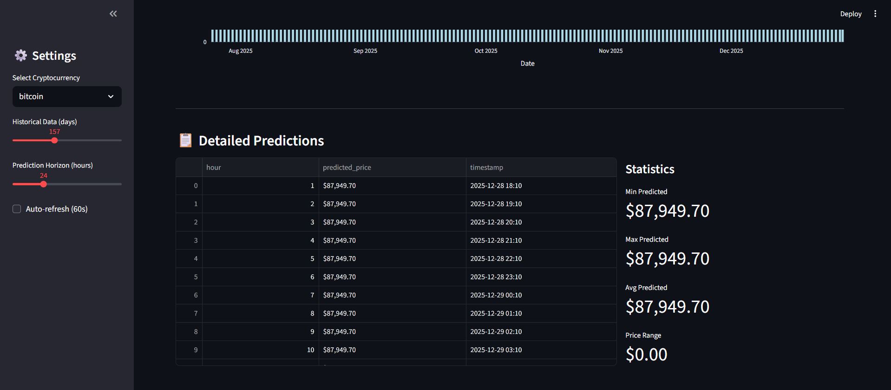
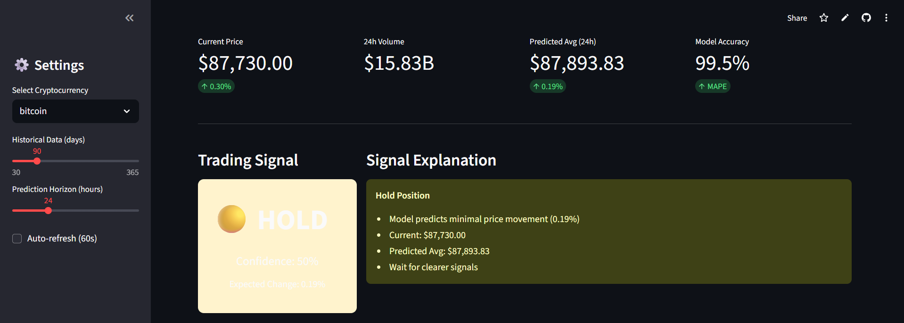

# Real-Time Crypto Price Predictor & Trading Signal Dashboard

> AI-powered cryptocurrency price prediction with automated trading signals using Machine Learning

## Project Overview

A real-time cryptocurrency analysis platform that predicts future prices and generates automated BUY/SELL/HOLD signals using Machine Learning. Built with Python, Streamlit, and scikit-learn.

### Key Features

-  **Real-Time Price Tracking** - Live crypto prices from CoinGecko API
-  **ML Price Prediction** - Random Forest model predicts next 24-72 hours
-  **Trading Signals** - Automated BUY/SELL/HOLD recommendations with confidence scores
-  **Interactive Dashboards** - Beautiful visualizations with Plotly
-  **Auto-Refresh** - Optional 60-second auto-update
-  **Technical Indicators** - Moving averages, volume analysis, trend detection

##  Live Demo

**[View Live App](https://crypto-predictor-hsq8rqynbzvf6o7amwq7nw.streamlit.app/)** 

## Tech Stack

- **Frontend:** Streamlit
- **Data:** CoinGecko API (free, no authentication)
- **ML Model:** Random Forest Regressor (scikit-learn)
- **Visualization:** Plotly
- **Deployment:** Streamlit Cloud

## Model Performance

- **Accuracy:** ~99.5% (MAPE < 0.5%)
- **Training Data:** 30-365 days of historical prices
- **Features:** 15+ technical indicators (MA, RSI, lag features, volatility)
- **Prediction Horizon:** 6-72 hours

##  Screenshots

